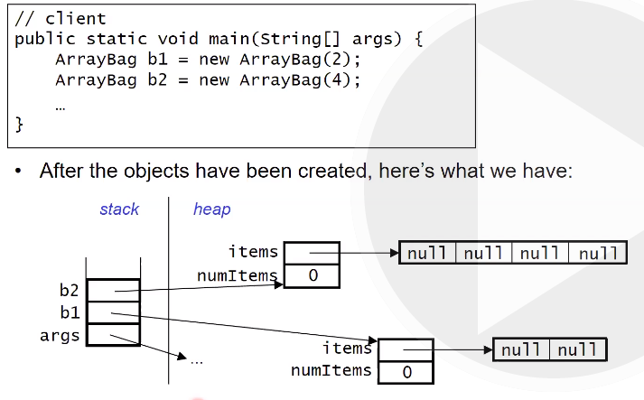

## Week 1 - Course intro and Java review

### Objects

An _object_ groups together:
- one or more data values (_fields_)
- a set of operations that the object can perform (_methods_)

In java, a class is used to define a new type of object. The class serves as a blueprint for the object.

We use a _constructor_ to create an object using the _new_ operator.

Methods that belong to an object are _instance methods_ or non-static methods. They have access to the fields of the object.

_Static methods_ belong to the class as a whole and have the word static in the header. Outside the class, we access them by prepending the class name (eg Math.max(...))

An **abstract data type** is a model of a data structure that specifies:
- the characteristics of the collection
- the operations that can be performed on the collection

It's abstract because it doesn't specify how it will be implemented.

### Example: A Bag

A Bag is a container for items. The position doesn't matter and they don't have to be unique. 

We want the following methods:
```
add(item)
remove(item): remove one occurence (if any) of item
contains(item)
numItems()
grab(): get an item at random
toArray()
```
We want the bag to store objects of any type.

Here's how we specify it in java:

```
public interface Bag{
    boolean add(Object item);
    boolean remove(Object item);
    boolean contains(Object item);
    int numItems();
    Object grab();
    Object[] toArray();
}
```

Then when using it, you use the `implements` keyword.

### Encapsulation

We prevent access to the internals of our class by making fields private.

We provide limited access by implementing methods that are public. All methods in an interface have to be public.

### Inheritance

We can define a class that extends another class. You get all fields and methods in the subclass; this is _inheritance_.

All classes implicitly extend the `Object` class. The object class includes methods all classes must possess, such as:
```
toString()
equals()
```

### Polymorphism

An object can be used whenever an object of one of its superclasses is called for. Thus, the same code can be used with many types of objects.

An interface name can be used as the type of the variable.

### Memory Management

There are 3 types of memory allocation in java:

- **Static Storage**: used for class variables, which are declared outside any method using the keyword `static`. There's only one copy of static variables, shared by all members of the class. If you add the keyword `final` it cannot be changed.

- **Stack**: Method parameters and local variables are stored in the stack. For each new method call, a new frame is added to the stack. Each frame includes the _return address_ so the frame knows where to jump back to.

- **Heap**: Objects including arrays are stored in the heap. 
`new` returns the memory address of the start of an object, and that's what's stored in a variable. An object remains on the heap until there are no longer any references to it.

Two constructors for ArrayBag class:

```
public class ArrayBag implements Bag{
    private Object[] items;
    private int numItems;
    pulic static final int DEFAULT_MAX_SIZE=50;

    public ArrayBag(){
        this.items = new Object[DEFAULT_MAX_SIZE];
        this.numItems = 0;
    }
    public ArrayBag(int maxSize){
        if (maxSize <= 0){
            throw new IllegalArgumentException(
                'maxSize must be >0');
        }
        this.items = new Object[maxSize];
        this.numItems = 0;
    } 
}
```

Here's what memory looks like after creating 2 ArrayBag objects:



When we copy a reference variable we are copying a reference (the memory location), not the variable itself.

When a method is passed an object or array as parameter, the method recieves a copy of the _reference_ to the object or array, not a copy of the object/array itself.

_null_ is a keyword that indicates that you don't currently have a reference.

Whenever you have a non static method, you also get a variable _this_ in the stack frame, which points to the called object.

Reminder: use `.equals()` instead of `==` when comparing objects.

Note that if you use polymorphism to make, for example, an ArrayBag that accepts items of type Object, and put some Strings in the ArrayBag, you cannot do this:

``` String s = stringBag.grab();```

Because the return type of ```grab()``` is Object, not String. Instead, you have to do this:

```String s = (String) stringBag.grab();```


