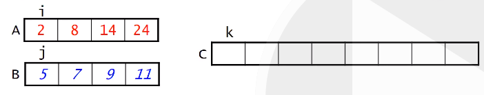

## Week 4 - Sorting continued

### Quicksort

Quicksort is a recursive, divide-and-conquer algorithm:
- divide: rearrange the elements so that we end up with two subarrays that meet the following criterion - _each element in left array <= each element in right array_
- conquer: apply quicksort recursively to subarrays, stopping when subarray has a single element
- combine: nothing needs to be done because of the way that we formed the subarrays

How do we partition the array?

We use one element to be used as the _pivot_. The left subarray is all elements <= pivot, and right subarray is all elements >= pivot.

Note the subarrays won't always have the same length, and that this is one of several options for pivot.

### Choosing a pivot
- first or last element: risky, can lead to bad outcomes
- middle element (we will use this)
- randomly chosen element

Example:
```
{7, 15, 4, 9, 6, 18, 9, 12}  // 9 is middle element

Maintain 2 indices i and j, starting them outside the array. i=first-1, j=last+1

Increment i until arr[i] >= pivot and increment j until arr[j] <= pivot

So i=1 (15) and j=6 (9)

Swap arr[i] and arr[j].

{7, 9, 4, 9, 6, 18, 15, 12}

Continue until i and j meet or cross.

i=3 (9) and j=5 (6)

{7, 9, 4, 6, 9, 18, 15, 12}
```

Implementation:

```
// partition helper method
private static int partition(int[] arr, int first, int last){
    int pivot = arr[(first + last) /2];
    int i = first - 1;
    int j = last + 1;

    while(true){
        do{
            i++;
        } while(arr[i] < pivot);
        do{
            j--;
        } while(arr[j]>pivot)
        if (i<j){
            swap(arr, i, j);
        } else{
            return j;
        }
    }
}

public static void quickSort(int[] arr){
    qSort(arr, 0, arr.length - 1);
}

private static void qsort(int[] arr, int first, int last){
    int split = partition(arr, first, last);

    if (first < split){ // if left subarry has 2+ values
        qSort(arr, first, split);
    }
    if (last > split + 1){ // if right subarray has 2+ values
        qSort(arr, split + 1, last);
    }
}
```

### Review of logarithms

log<sub>b</sub>n: the exponent to which b must be raised to equal n
log<sub>b</sub>n = p if b<sup>p</sup> = n

Ex. log<sub>2</sub>8 = 3

**Another way to look at logs**:

Repeatedly divide n by b using integer division.

log<sub>b</sub>n is an upper bound on how many divisions you need to get to 1.

Log is the inverse of exponentiation.

Example: log<sub>2</sub>18 = 4.17
You need to divide 18 by 2 4 times to get to 1.

So an O(logn) algorithm is one in which the number of operations is proportional to log<sub>b</sub>n for any base b.

Note: log<sub>b</sub>n grows much more slowly than n.

So, for large values, a O(logn) algorithm is much faster than O(n) algorithm.

### Time analysis of Quicksort

Partitioning an array of length n requires about n comparisons.

**In best case**, paritioning always divides the array exactly in half. At each partition, there are n comparisons.

So at each level except the bottom, there are n comparisons. At each level, we are dividing by 2. So the number of levels is roughly equal to our log definition above - log<sub>2</sub>n). Since we're doing n comparisons at each level, C(n) = O(nlogn)

M(n) is similar to C(n), O(nlogn).

**In worst case**, pivot is always smallest or largest element. C(n) = O(n<sup>2</sup>)

**Average case** is harder to analyse, but it's O(nlogn)

### Mergesort
- Different that other algorithms we've examine in that it uses a small amount of additional memory.

It's based on the process of mergin 2 already sorted arrays.

To merge we keep track of 3 variables, i, j, and k:



Then we repeatedly:
1. Compare A[i] and B[j]
2. Copy the smaller of the two to C[k]
3. Increment the index of the array that was copied
4. Increment k

So mergesort is a divide-and-conquer algorithm like quicksort:

- divide: split array in half, forming 2 subarrays
- conquer: apply mergesort recursively to the subarrays, stopping when a subarray has a single element
- combine: merge the sorted subarrays

```
public static void merge(int[] arr, int[] temp, int leftStart, int rightStart, int leftEnd, int rightEnd){
    int i = leftStart;
    int j = rightStart;
    int k = leftStart;

    while (i <= leftEnd && j <= rightEnd){
        if (arr[i] < arr[j]){
            temp[k] = arr[i];
            i++; k++;
        } else{
            temp[k] = arr[j];
            j++; k++;
        }
    }
    while (i <= leftEnd){
        temp[k] = arr[i];
        i++; k++;
    }
    while (j <= rightEnd){
        temp[k] = arr[j];
        j++; k++;
    }
    for (i = leftstart; i <= rightEnd; i++){
        arr[i] = temp[i];
    }
}

public static void mSort(int[] arr, int[] temp, int start, int end){
    if (start >= end){
        return;
    } else{
        int middle = (start + end) / 2;
        mSort(arr, temp, start, middle);
        mSort(arr, temp, middle+1, end);
        merge(arr, temp, start, middle, middle+1, end);
    }
}
```

### Time analysis of Mergesort

Merging two halves of an array of size n requires 2n moves - each element is moved out to temp and back.

We are always dividing in half. So our definition of log comes back, and there are log<sub>2</sub>n levels

So M(n) = O(nlogn) and C(n) = O(nlogn)

### Summary of sorting algorithms (so far)


Insertion best for nearly sorted arrays.

Mergesort has best worst case complexity, but requires O(n) extra memory.

Quicksort comparable to mergesort in best/avg case, but requires less memory and fewer moves.

### Comparison based vs Distributive sorting

Everything we've discussed so far has been comparison based; we don't 'take them apart' in any way.

No comparison based algorithm can do better than O(nlog<sub>2</sub>n).

Distributive sorting algorithms actually perform calculations on values being sorted.

### Radix sort

Break each value into m components, each of which has k possible values.

Example: integer in range 0-999. m=3, k=10
String of 15 upper case letters. m=15, k=26
32 bit integer. m=32, k=2

Strategy: distribute values into bins according to their last component, then concatenate results.

Example:
```
{33, 41, 12, 24, 31, 14, 13, 42, 34}

41 31    12 42    33 13    24 14 34

Repeat, moving back one component

12 13 14   24   31 33 34   41 42
```
**We never compare the values to each other**

### Time analysis of Radix sort

O(m*n): we perform m distributions, each of which processes all n values

How does this compare to O(nlogn)?

It is smaller than nlogn provided that m is smaller than logn.

So we want m to be small. But as m decreases, k decreases. And as k increases, so does memory usage.

### Revisiting Big O


How does number of operations scale?

Let's say we have a problem with n=1000, and we double to n=2000.

How would number of operations by following algorithms increase if it is:

O(n) time: 2x  
O(n<sup>2</sup>): 4x - it goes from n<sup>2</sup> to (2n)<sup>2</sup>  
O(n<sup>3</sup>): 8x  
O(log<sub>2</sub>n): logn -> log2n = logn + 1  
O(2<sup>n</sup>): 2^n -> 2^2n = (2^n)^2


