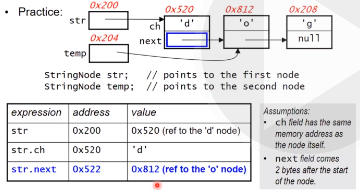

## Week 5 - Linked Lists

### Representing a sequence of data

A **sequence** is an ordered collection of items
- most commonly represented by an array

Advantages of array:
- Random access - access any element in O(1) time because array elements are right next to each other in memory
- Compact (but can waste space if elements are empty)

Disadvantages:
- Need to preallocate and resize if needed
- If you want to add/delete item, have to shift other items

Alternative implementation - **linked list**

Items are stored in nodes, each of which contains a single item and a link to the node containing the next item. The last node in the list has a reference to null. The variable that holds the reference to the linked list holds a reference to the first node.

The nodes are not next to each other in memory - that's why you need the links.

Advantages:
- Can grow without limit
- Easier to insert/delete - don't need to shift other elements

Disadvantages:
- No random access
- The links take up additional memory

### Example: a string as a linked list of characters

```
public class StringNode{
    private char ch;
    private StringNode next;

    public StringNode(char c, StringNode n){
        this.char = c;
        this.next = n;
    }
}
```
The string can be represented with a reference to the first StringNode.

An empty string is represented by null:

```StringNode str2 = null;```

We'll use static methods that that the string as a parameter instead of class methods. This allows us to handle empty strings.

### Variables

Each variable represents:
- a 'box' in memory where the variable resides (address)
- the value of the contents of that box (value)



More advanced expressions:

`temp.next.ch` would equal 'g'.

`str.next.next` would have the value Ox208 and memory address Ox814.

### Assignment

An assignment statement `var1 = var2` takes the value of var2 and copies it into the memory address of var1.

So if var2 is an integer, it copies the _value_ of var2 into var1.

If var2 is an array, it is a memory address to the start of the array, and the memory address is copied. 

### Linked lists are inherently recursive

A linked list is either:
- empty
- a single node, followed by a linked list

(I skipped over a recursive method to determine the length of a linked list that was pretty straightforward. Basically use str == null as the stopping condition and call str.next recursively)

You can also use iteration to traverse a linked list. We use a variable (called 'trav' here) to keep track of where we are in the linked list.

```
StringNode trav = str;  // first node
while (trav != null){
    // process current node
    trav = trav.next;
}
```

Example: toUpperCase

```
public static void toUpperCase(StringNode str){
    StringNode trav = str;
    while(trav != null){
        trav.ch = Character.ToUpperCase(trav.ch);
        trav = trav.next;
    }
}
```

### Getting the node at position i of a linkedlist
- Recall that we don't have random access to the elements of a linked list. We have to traverse it.

```
private static StringNode getNode(StringNode str, int i){
    if (i < 0 || str == null){
        return null;
    } else if (i == 0){
        return str;
    } else {
        return getNode(str.next, i - 1);
    }
}
```

### Deleting the item at position i
If i = 0, just set the reference to the first node to str.next.

1. First, we get a reference to the node at i - 1 (prevNode)
2. Next, we set prevNode.next to prevNode.next.next

```
public static StringNode deleteChar(StringNode str, int i){
    if (str == null){
        throw new IllegalArgumentException("string is empty");
    } else if (i == 0){
        str = str.next;
    } else {
        StringNode prevNode = getNode(str, i -1);
        if (prevNode != null && prevNode.next != null){
            prevNode.next = prevNode.next.next;
        } 
    }
    return str;
}
```

### Inserting an item at position i
If i = 0, create the new node, and set its next field to the current first node. Then, assign str to the new node.

Otherwise, create the new node and insert it before the item currently in position i. Update the references.

```
public static void insertChar(StringNode str, int pos, char c){
    StringNode newNode, prevNode;
    if (i == 0){
        newNode = new StringNode(c, str.next);
        str = newNode;
    } else {
        prevNode = getNode(str, i - 1);
        if (prevNode != null) {
            newNode = new StringNode(ch, prevNode.next);
            prevNode.next = newNode;
        } else {
            throw new IllegalArgumentException("invalid index: " + i);
        }
    }
    return str;
}
```

### Creating a copy of linked list

```
public static StringNode copy(StringNode str){
    if (str == null){
        return null;
    }
    StringNode copyRest = copy(str.next);

    return new StringNode(str.ch, copyRest);
}


